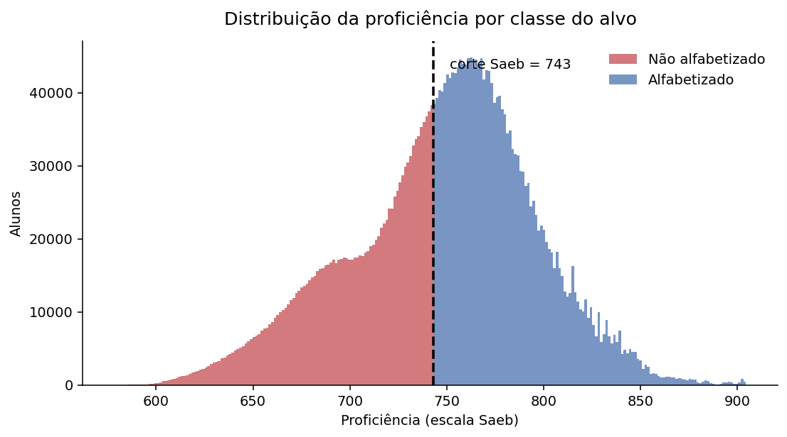
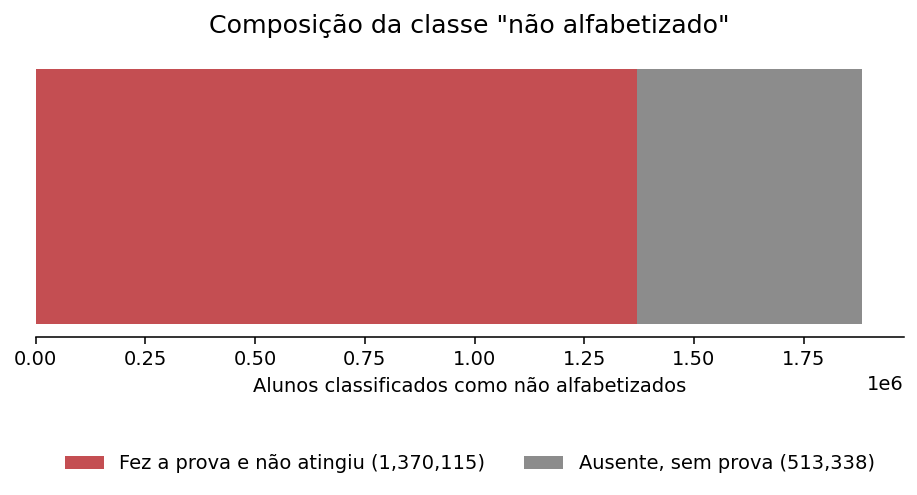
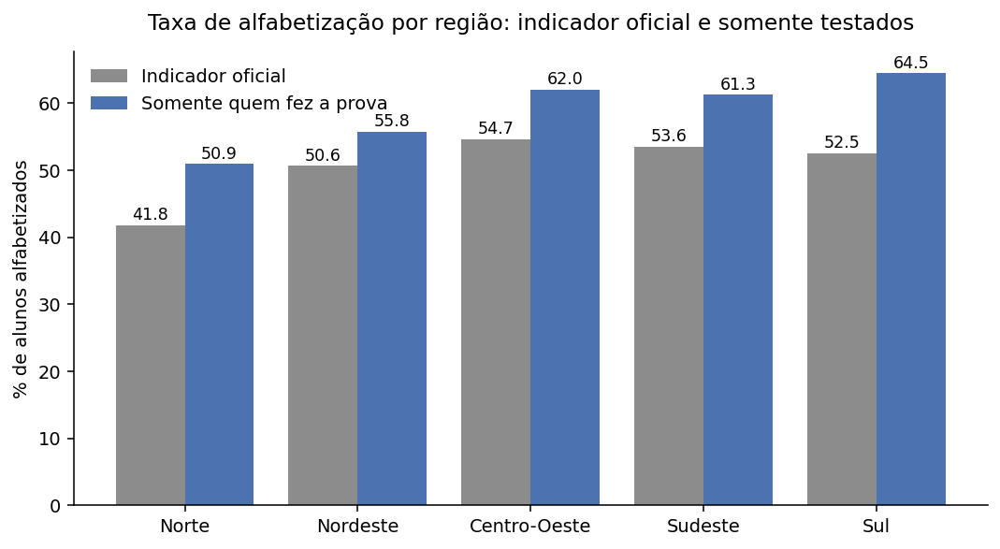
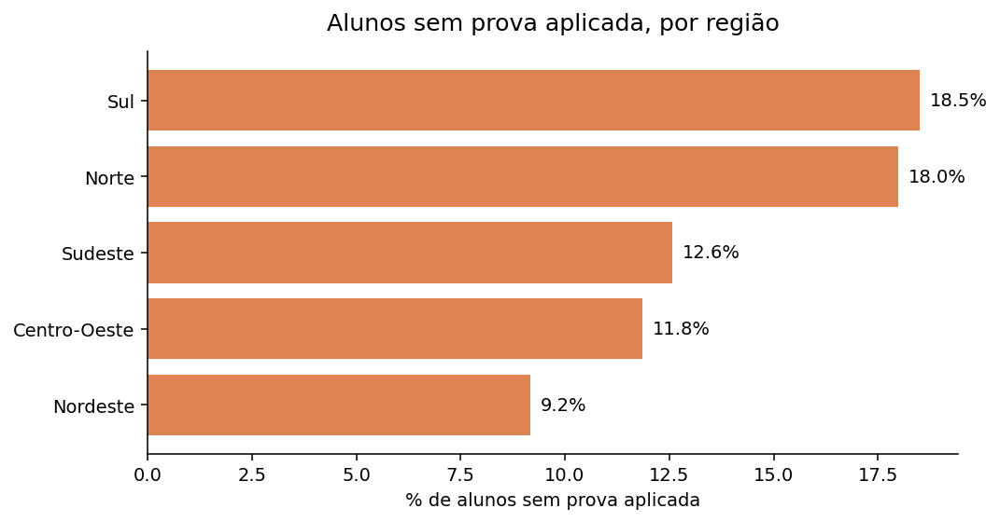
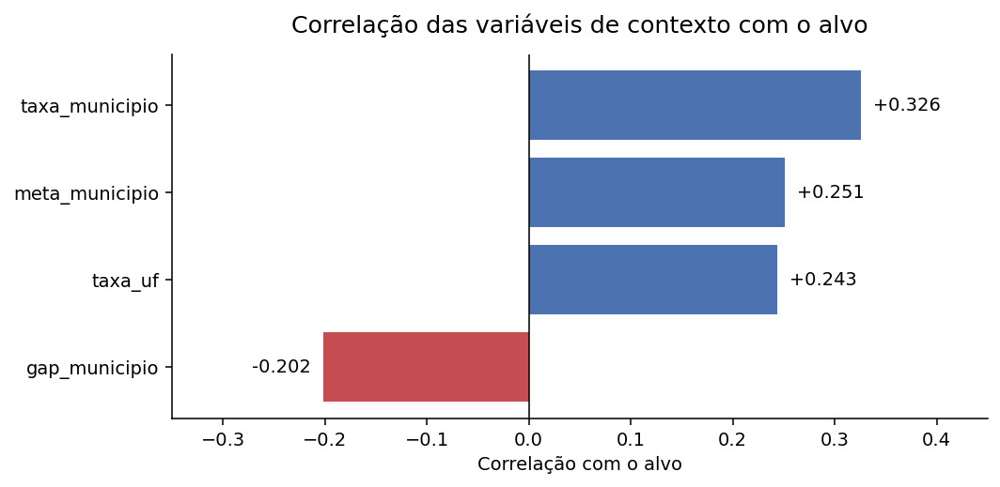
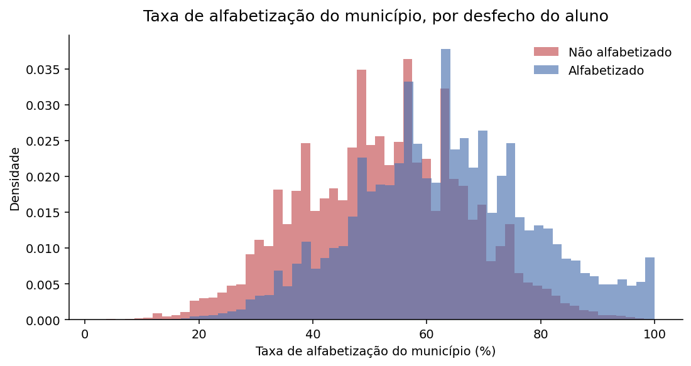

# Análise exploratória

Base: 3.867.999 alunos, 5.548 municípios, 42.811 escolas, anos de 2023 e 2024.
Os números vêm de `reports/analise_exploratoria.json` e as figuras de `images/`.

O objetivo desta etapa foi entender o que a base permite prever e, principalmente,
o que não pode entrar no modelo.

---

## 1. Variáveis que determinam o alvo

A primeira suspeita era sobre a `proficiencia`, já que o alvo é definido pelo corte
de 743 pontos. A checagem confirmou:

| | Valor |
|---|---|
| Proficiência máxima entre não alfabetizados | 742,999819 |
| Proficiência mínima entre alfabetizados | 743,000000 |
| Concordância entre `proficiencia >= 743` e o alvo | 100,0000% |

Não há uma única linha fora do padrão. A variável não prediz o alvo: ela é o alvo
convertido em escala contínua. Um modelo treinado com ela acertaria tudo e não
serviria para nada, porque no momento em que a predição teria valor (antes da
avaliação) a proficiência ainda não existe.

Ao cruzar as demais colunas apareceu algo que eu não esperava. Todo aluno com
`presenca = 0` está classificado como não alfabetizado, sem uma exceção em 512 mil
casos. O mesmo vale para `preenchimento_caderno`. Ou seja, ausência é registrada
como não alfabetização, o que torna essas duas colunas tão determinantes quanto a
proficiência.

As quatro colunas ficam fora do treino (a quarta é `peso_aluno`, atribuída depois
da prova). A lista está em `config/settings.py`.

## 2. Composição da classe negativa

A descoberta acima levantou outra questão: se ausência vira rótulo negativo, quanto
da classe 0 é desempenho e quanto é falta de medição?

Dos 1.883.453 alunos classificados como não alfabetizados, 513.338 nunca fizeram a
prova. São 27,3% da classe negativa sem nenhuma medição de aprendizagem.

Isso muda a pergunta que o modelo responde. Incluindo os ausentes, a pergunta é
"este aluno será contabilizado como não alfabetizado?", que mistura aprendizagem com
presença. Restringindo aos testados, é "este aluno, ao fazer a prova, atingirá o
corte?".

A decisão prática foi pela segunda opção, e por um motivo técnico além do
conceitual: as variáveis que sinalizam ausência são justamente as excluídas por
vazamento. Manter esses 513 mil registros adicionaria linhas com as mesmas features
dos demais e rótulo sempre zero, o que é ruído puro para o treino.

## 3. Efeito da ausência sobre o indicador regional

Separar aprendizagem de participação reordena as regiões:

| Região | Indicador oficial | Entre testados | Diferença |
|---|---|---|---|
| Sul | 52,5% (3º) | 64,5% (1º) | +12,0 p.p. |
| Centro-Oeste | 54,7% (1º) | 62,0% (2º) | +7,3 p.p. |
| Sudeste | 53,6% (2º) | 61,3% (3º) | +7,7 p.p. |
| Nordeste | 50,6% (4º) | 55,8% (4º) | +5,2 p.p. |
| Norte | 41,8% (5º) | 50,9% (5º) | +9,1 p.p. |

O Sul lidera em desempenho entre quem faz a prova, mas cai para terceiro no
indicador oficial. A razão está na participação:

| Região | Alunos sem prova |
|---|---|
| Sul | 18,5% |
| Norte | 18,0% |
| Sudeste | 12,6% |
| Centro-Oeste | 11,8% |
| Nordeste | 9,2% |

O Sul tem a maior ausência do país e o Nordeste a menor, num quadro oposto ao do
desempenho. São dois problemas diferentes: levar a criança à avaliação não é o mesmo
que garantir que ela aprenda, e cada um pede uma política distinta. Um indicador
único não distingue qual dos dois está falhando num território.

## 4. Origem do sinal preditivo

| Variável | Correlação com o alvo |
|---|---|
| `taxa_municipio` | +0,326 |
| `meta_municipio` | +0,251 |
| `taxa_uf` | +0,243 |
| `gap_municipio` | −0,202 |

Retirado o vazamento, sobra pouco do próprio aluno. A `serie` é constante, já que
todos estão no 2º ano; a `rede` tem três valores; e o `caderno` identifica a versão
da prova aplicada. Não avaliei se o caderno carrega sinal, fica para a etapa de
features.

A capacidade preditiva, portanto, depende do contexto territorial.

A separação entre as curvas existe, mas há bastante sobreposição. É o teto realista
do projeto: um modelo informativo, sem pretensão de acerto individual.

## 5. Problemas encontrados nos dados

**As metas por UF vieram todas nulas.** Achei que fosse erro do join e fui conferir
a Gold direto no BigQuery. O motivo é outro: a meta por UF só existe para `rede = 5`,
a rede pública agregada, e apenas em 2024. Nenhum aluno pertence a essa rede, então
o join nunca encontra correspondência. As colunas `meta_uf` e `gap_uf` saem da base
por serem 100% nulas.

**A meta municipal cobre metade dos dados.** Existe apenas para 2024 na rede
municipal, o que dá 54% de ausência no total. A falta é sistemática e não aleatória,
já que indica ano e rede em vez de falha de coleta. Será tratada com marcação
explícita, não com imputação silenciosa.

**O `id_aluno` não identifica uma pessoa.** Eu pretendia agrupar a validação por
aluno até verificar isto:

| `id_aluno` | ano | município | escola | alfabetizado |
|---|---|---|---|---|
| 11001110 | 2023 | 1100023 | 60000217 | 0 |
| 11001110 | 2024 | 1100262 | 60000233 | 1 |

Mesmo código, município e escola diferentes. E como toda a base é de 2º ano, uma
criança avaliada em 2023 estaria no 3º ano em 2024 e não deveria reaparecer aqui.
Dos 1.515.671 códigos presentes nos dois anos, 1.274.442 aparecem em mais de um
município.

A consulta aos metadados da fonte confirma o motivo: a coluna `id_escola` é
descrita como *"Máscara do código da escola (códigos fictícios)"*. São
identificadores anonimizados, reatribuídos a cada edição para impedir que aluno e
escola sejam rastreados entre anos. O comportamento não é defeito da base, é
requisito de privacidade.

Isso descarta qualquer feature de trajetória individual e leva o agrupamento da
validação para o nível de município, o único identificador real.

## 6. Hipóteses e decisões para a modelagem

A análise sustenta quatro hipóteses. A primeira é que o contexto do município
concentra o poder preditivo, o que faz das variáveis territoriais o núcleo do
modelo. A segunda é que aprendizagem e participação são fenômenos distintos, o que
justifica modelar apenas a população testada. A terceira é que a desigualdade
regional é estrutural e não ruído, então região e UF entram como preditores. A
quarta é que o teto de desempenho é moderado, o que pede métricas realistas em vez
de perseguir acurácia alta.

Saem da base:

| Coluna | Motivo |
|---|---|
| `proficiencia` | define o alvo |
| `presenca`, `preenchimento_caderno` | determinam o alvo quando iguais a zero |
| `peso_aluno` | peso amostral atribuído após a prova |
| `serie` | valor constante |
| `meta_uf`, `gap_uf` | 100% nulas |

Permanecem `rede`, `caderno`, `regiao`, `sigla_uf`, `ano`, `taxa_municipio`,
`meta_municipio`, `gap_municipio`, `atingiu_meta` e `taxa_uf`.

A população de treino passa a ser a dos alunos com prova aplicada, 3.354.661 linhas,
e a validação é agrupada por município para que o mesmo território não apareça em
treino e teste.
