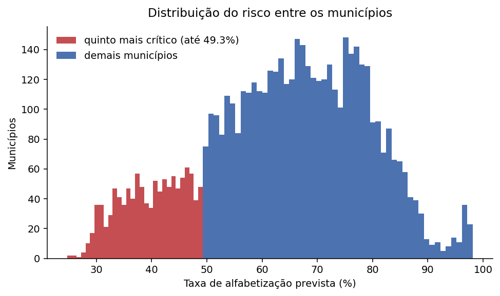
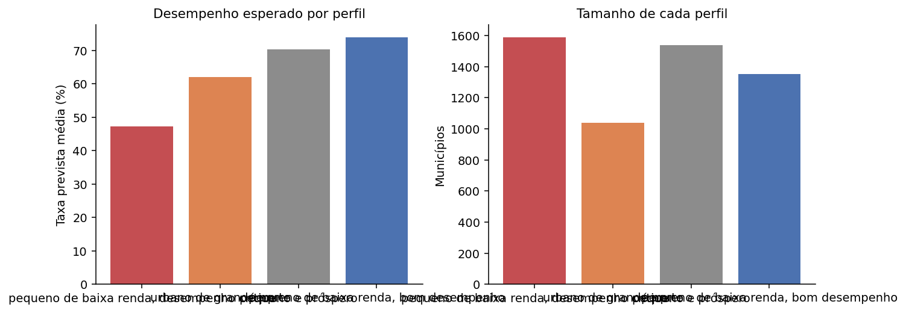

# Aplicação estratégica

A avaliação mostrou que o modelo erra bastante em cada aluno e acerta bem quando as
predições são agregadas por município, com correlação de 0,83 contra a taxa real.
Este passo trabalha nesse nível.

Responde três perguntas do desafio: quais municípios apresentam maior risco, quais
territórios têm padrões semelhantes e quais tendem a não atingir a meta de 2030.

---

## 1. Risco por município

A taxa prevista de cada município é a média das probabilidades individuais dos seus
alunos. É a proporção esperada de crianças alfabetizadas, que é a grandeza sobre a
qual a decisão de política se apoia.

O quinto mais crítico reúne **1.028 municípios** com taxa prevista de até 49,3%, e a
concentração territorial é acentuada:

| Região | Municípios no quinto mais crítico |
|---|---|
| Nordeste | 690 |
| Norte | 211 |
| Sul | 93 |
| Sudeste | 20 |
| Centro-Oeste | 14 |

Municípios com menos de 30 alunos avaliados ficam marcados na saída. A taxa deles é
instável e uma priorização não deveria se apoiar nela sem ressalva.

## 2. Perfis de território

O agrupamento usa contexto e não o desfecho: histórico do município, IDEB, PIB per
capita e porte. Os quatro grupos são descritos depois pela taxa que apresentam.

| Perfil | Municípios | Taxa prevista | IDEB | População média | PIB per capita | Região predominante |
|---|---|---|---|---|---|---|
| Pequeno de baixa renda, desempenho crítico | 1.590 | 47,3% | 4,85 | 12,5 mil | R$ 16,6 mil | Nordeste (67%) |
| Urbano de grande porte | 1.038 | 62,1% | 6,03 | 64,0 mil | R$ 49,3 mil | Sudeste (46%) |
| Pequeno e próspero | 1.538 | 70,4% | 6,50 | 5,6 mil | R$ 47,7 mil | Sul (51%) |
| Pequeno de baixa renda, bom desempenho | 1.351 | 74,0% | 6,08 | 9,3 mil | R$ 16,6 mil | Sudeste (43%), Nordeste (41%) |

Os rótulos descrevem o perfil em vez de ordená-lo. Uma numeração por desempenho
esconderia o achado mais útil da tabela.

**O primeiro e o quarto grupo têm o mesmo PIB per capita, R$ 16,6 mil, e taxas de
47,3% e 74,0%.** São vinte e sete pontos de diferença entre municípios igualmente
pobres. A renda não determina o resultado, e há mil e trezentos municípios de baixa
renda alfabetizando acima da média nacional.

Isso desloca a pergunta de política pública. Em vez de tratar pobreza como
explicação, vale investigar o que os municípios do quarto grupo fazem que os do
primeiro não fazem. Este projeto não responde isso, porque não tem variáveis de
gestão, formação docente ou material didático. Mas identifica onde procurar.

## 3. Ritmo até a meta de 2030

| | Valor |
|---|---|
| Taxa média em 2024 | 63,4% |
| Meta média para 2030 | 80,0% |
| Ritmo necessário | 2,76 p.p./ano |
| Ritmo observado entre 2023 e 2024 | 2,68 p.p./ano |
| Defasagem | −0,08 p.p./ano |

No agregado nacional o país avança quase no ritmo exigido, com uma defasagem de
menos de um décimo de ponto por ano. Mantido esse ritmo, a meta de 2030 fica ao
alcance por pouco.

### Por que não há classificação por município

A primeira versão desta análise classificava cada município como no ritmo, em ritmo
insuficiente ou em retrocesso, e apontava 35,5% em retrocesso. O número não
sobrevive à verificação.

O município mediano teve **112 alunos avaliados**. Com essa amostra, o desvio padrão
da taxa é de cerca de 4,6 pontos percentuais, então uma variação de até nove pontos
entre dois anos pode ser apenas sorteio. A variação observada tem desvio de **16,4
pontos**, e 17,9% dos municípios oscilaram mais de dez pontos em um único ano, o que
não é mudança educacional plausível.

Com dois pontos no tempo não há como separar movimento real de ruído amostral em
cada município. A leitura agregada continua válida porque o erro de amostragem se
cancela entre milhares de municípios, mas a classificação individual seria uma
afirmação que os dados não sustentam.

Uma terceira medição, em 2025, permitiria distinguir tendência de oscilação.

## 4. O que foi publicado

Duas tabelas no dataset `alfabetizacao_gold`, ao lado das quatro da Fase 2:

| Tabela | Linhas | Conteúdo |
|---|---|---|
| `base_modelagem` | 1.851.852 | Base analítica no grão de aluno |
| `risco_municipio` | 5.517 | Escore de risco, perfil e distância da meta |

A segunda é a que um gestor consumiria: uma linha por município, com taxa prevista,
perfil, marcação de amostra pequena e distância até a meta de 2030. As descrições
de tabela e de coluna vão no próprio BigQuery.

## 5. Como isso apoia decisão

O modelo não decide sobre uma criança. O ROC-AUC de 0,66 no aluno e a revocação de
34% na classe de risco no limiar padrão deixam claro que essa não é a aplicação.

O que ele entrega é ordenação de territórios com correlação de 0,83, o que sustenta
três usos concretos:

- **Priorizar onde atuar.** Os 1.028 municípios do quinto mais crítico, com a
  concentração no Nordeste e no Norte já explicitada.
- **Comparar pares.** Os perfis permitem confrontar municípios de contexto
  semelhante, e a diferença entre os dois grupos de baixa renda indica que existe
  margem de melhoria não explicada por recursos.
- **Acompanhar a meta.** O ritmo agregado mostra o país perto do necessário, com a
  ressalva de que o acompanhamento por município exige mais uma medição.
