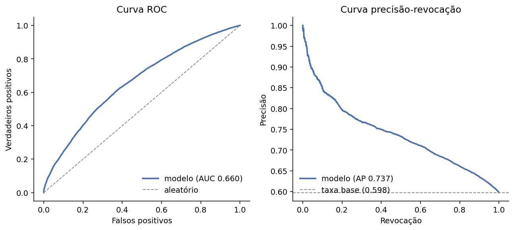
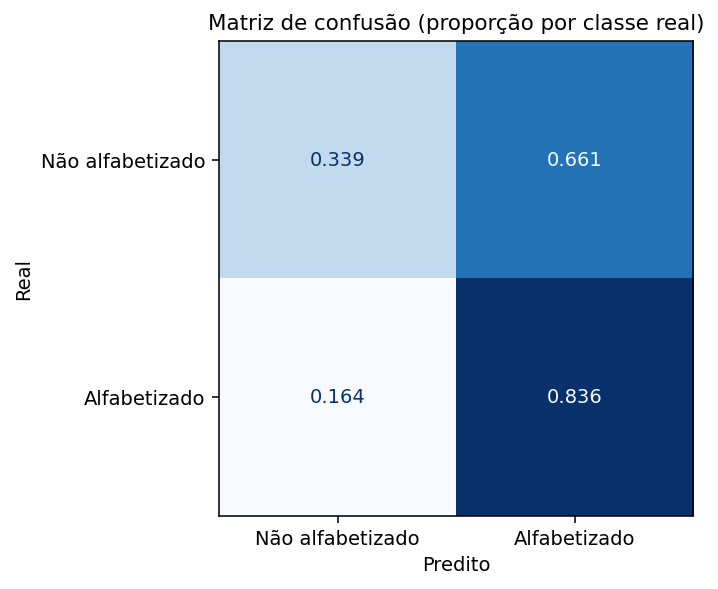
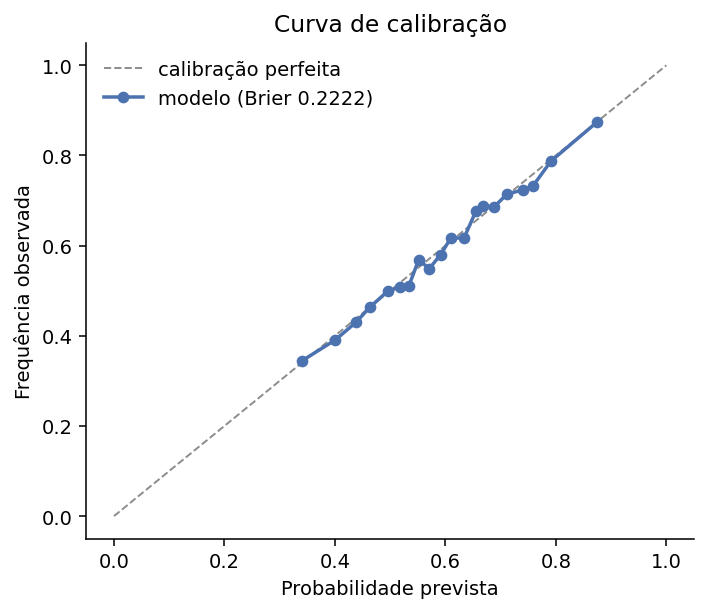
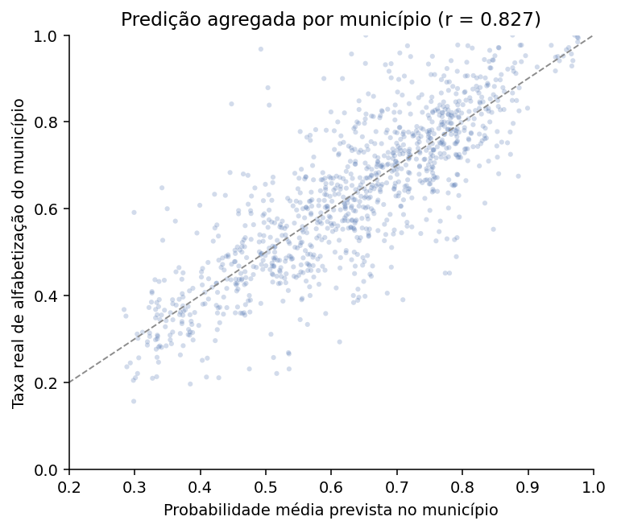
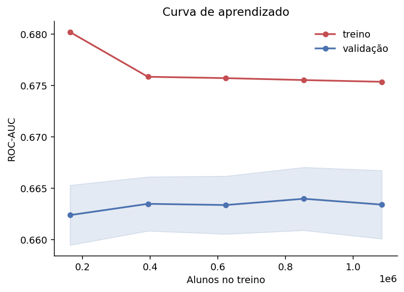

# Avaliação do modelo

Avaliação no conjunto retido: 357.507 alunos de 1.164 municípios que não
apareceram no treino.

O passo anterior mediu o desempenho agregado. Aqui interessa como o erro se
distribui, se as probabilidades são confiáveis, se mais dados ajudariam e em que
nível de decisão o modelo é de fato útil.

---

## 1. O desempenho é assimétrico entre as classes

| Classe | Precisão | Revocação | F1 | Alunos |
|---|---|---|---|---|
| Não alfabetizado | 0,582 | **0,339** | 0,428 | 143.794 |
| Alfabetizado | 0,653 | 0,836 | 0,733 | 213.713 |

A revocação de 0,339 na classe negativa é o número mais importante deste
relatório, e o mais desconfortável. No limiar padrão, **o modelo encontra apenas
34% das crianças que não serão alfabetizadas**, exatamente as que uma política
pública precisaria alcançar.

A causa é o limiar de 0,5, que maximiza acurácia. Como 59,78% dos alunos são
alfabetizados, chutar a classe majoritária já acerta bastante, e o modelo se
inclina para esse lado.

## 2. O limiar padrão é o objetivo errado

Acurácia trata falso positivo e falso negativo como equivalentes. Neste problema
eles não são: sinalizar uma criança que ficaria bem custa uma avaliação
pedagógica a mais; deixar de sinalizar uma criança em risco custa uma criança não
alfabetizada.

| Limiar | Encontra em risco | Precisão na classe 0 | Acurácia |
|---|---|---|---|
| 0,50 (padrão) | 33,9% | 0,582 | 0,636 |
| 0,55 | 50,5% | 0,544 | 0,631 |
| 0,60 | 63,5% | 0,518 | 0,615 |
| **0,65** | **74,2%** | 0,492 | 0,588 |
| 0,70 | 85,4% | 0,458 | 0,535 |
| 0,75 | 91,9% | 0,439 | 0,495 |

Em 0,65 o modelo passa a encontrar três em cada quatro crianças em risco, contra
uma em cada três no limiar padrão. O preço é 4,8 pontos de acurácia e uma precisão
de 0,49, ou seja, metade dos alunos sinalizados não precisaria da atenção extra.

Para triagem educacional essa troca é favorável. A recomendação é operar em 0,65 e
tratar a saída como **lista de prioridade**, não como diagnóstico.

## 3. As probabilidades são utilizáveis, com ressalva

O Brier score é 0,2222, contra 0,25 de um chute constante na taxa base. A melhora
existe mas é modesta, coerente com um modelo informativo e não decisivo.

A calibração importa mais que a acurácia para o uso pretendido: ordenar
territórios exige que uma probabilidade de 0,3 corresponda de fato a 30% de
frequência observada.

## 4. Onde o modelo realmente funciona

Agregando as predições por município e comparando com a taxa real:

| | Valor |
|---|---|
| Municípios avaliados (30+ alunos) | 1.048 |
| Correlação de Pearson | **0,827** |
| Correlação de Spearman | **0,819** |
| Erro médio absoluto | 7,47 p.p. |

Este é o resultado central da avaliação. O mesmo modelo que alcança ROC-AUC de
0,66 no aluno atinge **correlação de 0,83 no município**.

Não há contradição. Os erros individuais são grandes mas não sistemáticos, então
se cancelam na média. O modelo não sabe qual criança daquele município não será
alfabetizada, mas sabe bem *quantas* não serão.

Isso define a aplicação correta: **ordenar territórios por risco**, não decidir
sobre uma criança. É também a base quantitativa para as perguntas de negócio sobre
municípios em risco e sobre quem tende a não atingir as metas.

## 5. Mais dados não ajudariam

| Alunos no treino | ROC-AUC de validação |
|---|---|
| ~224 mil | 0,6624 |
| ~448 mil | 0,6635 |
| ~672 mil | 0,6634 |
| ~896 mil | 0,6640 |
| ~1,49 milhão | 0,6634 |

A curva é plana. Multiplicar o treino por seis não move a terceira casa decimal.

Isso fecha a questão aberta no passo anterior: o limite não é volume de dados nem
escolha de algoritmo, é a **granularidade da informação disponível**. Doze das 14
features descrevem o município ou a UF, e as duas restantes, `rede` e `caderno`, são
atributos administrativos do aluno; nenhuma descreve a criança em si, o professor ou a
família. Dois alunos do mesmo município e da mesma rede são indistinguíveis para o
modelo, e é aí que mora a variância que sobra.

## 6. Síntese

O modelo é confiável para **priorizar territórios** e fraco para **decidir sobre
indivíduos**. Operado em 0,65, funciona como instrumento de triagem que encontra
74% das crianças em risco ao custo de sinalizar algumas que ficariam bem.

As limitações são conhecidas e medidas, não suposições: teto de 4,55 pontos de
acurácia com informação municipal, curva de aprendizado plana e identificadores de
aluno e escola inutilizáveis por serem reaproveitados entre anos.
