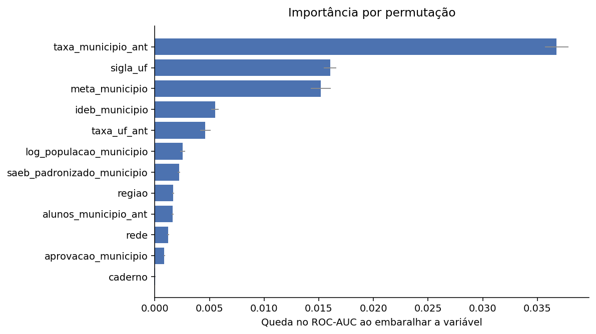
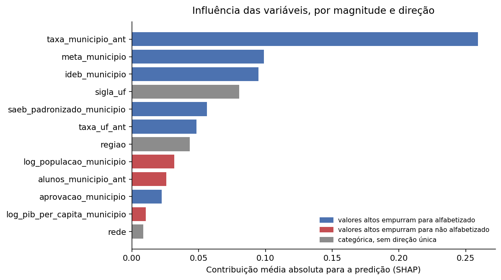
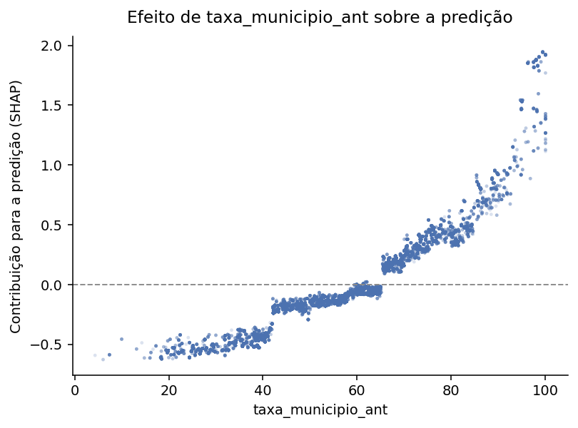

# Interpretabilidade

Duas perguntas do desafio são respondidas aqui: quais variáveis têm maior
influência no modelo, e quais fatores mais impactam a alfabetização. Elas parecem
a mesma pergunta e não são — a diferença aparece na última seção.

Foram usadas duas técnicas. A **importância por permutação** embaralha uma
variável por vez e mede a queda no ROC-AUC, sobre 120 mil alunos do conjunto
retido. O **SHAP** decompõe 40 mil predições individuais e mostra também a direção
do efeito.

---

## 1. O que o modelo usa para decidir

| Variável | Queda no ROC-AUC |
|---|---|
| `taxa_municipio_ant` | **0,0368** ±0,0011 |
| `sigla_uf` | 0,0160 ±0,0006 |
| `meta_municipio` | 0,0152 ±0,0009 |
| `ideb_municipio` | 0,0055 ±0,0003 |
| `taxa_uf_ant` | 0,0046 ±0,0005 |
| `log_populacao_municipio` | 0,0026 ±0,0002 |
| `saeb_padronizado_municipio` | 0,0022 ±0,0001 |
| `regiao` | 0,0017 ±0,0001 |
| `alunos_municipio_ant` | 0,0016 ±0,0001 |
| `rede` | 0,0012 ±0,0001 |

A taxa histórica do próprio município domina, com queda 2,3 vezes maior que a
segunda colocada. As cinco primeiras variáveis são todas territoriais.

O SHAP concorda na ordem de grandeza e acrescenta o sinal do efeito:

| Variável | Magnitude | Direção |
|---|---|---|
| `taxa_municipio_ant` | 0,2593 | +0,93 → alfabetiza |
| `meta_municipio` | 0,0988 | +0,84 → alfabetiza |
| `ideb_municipio` | 0,0947 | +0,95 → alfabetiza |
| `sigla_uf` | 0,0805 | categórica |
| `saeb_padronizado_municipio` | 0,0562 | +0,94 → alfabetiza |
| `taxa_uf_ant` | 0,0484 | +0,80 → alfabetiza |
| `regiao` | 0,0433 | categórica |
| `log_populacao_municipio` | 0,0319 | −0,82 → não alfabetiza |
| `alunos_municipio_ant` | 0,0258 | −0,67 → não alfabetiza |
| `aprovacao_municipio` | 0,0222 | +0,60 → alfabetiza |

A direção é a correlação entre o valor da variável e sua contribuição. A média das
contribuições não serve para isso: ela fica negativa sempre que a maioria dos
alunos está abaixo do ponto em que o efeito troca de sinal, o que descreve a
distribuição da amostra e não o comportamento da variável.

O efeito da taxa histórica é monotônico e cruza o zero perto de 62%. Abaixo disso
a variável empurra a predição para não alfabetizado; acima, para alfabetizado.

## 2. O que descreve o aluno quase não pesa

A `rede` fica em décimo, com queda de 0,0012, e o `caderno` não aparece entre as
dez primeiras.

Isso encerra uma ponta solta deixada no passo de engenharia de atributos, onde
ficou registrado que o `caderno` seguia sem avaliação individual. Ele identifica a
versão da prova aplicada e, se a atribuição for aleatória como se espera, não deve
carregar sinal. Não carrega.

## 3. O porte do município: efeito real, mas quase todo indireto

O SHAP aponta que população maior empurra a predição para baixo, com correlação de
−0,82, enquanto a associação bruta com o alvo é de apenas −0,045. A diferença
merecia verificação antes de virar afirmação.

Taxa de alfabetização por quinto de população:

| Porte | População mediana | Taxa |
|---|---|---|
| Muito pequeno | 12 mil | 64,2% |
| Pequeno | 38 mil | 60,3% |
| Médio | 114 mil | 59,6% |
| Grande | 361 mil | 57,9% |
| Muito grande | 2,4 milhões | 56,8% |

A queda é monotônica, de 7,4 pontos entre os extremos. Municípios menores
alfabetizam mais.

Controlando pela taxa histórica, porém, quase todo o efeito desaparece:

| Histórico | Muito pequeno | Pequeno | Médio | Grande | Muito grande |
|---|---|---|---|---|---|
| Baixo | 46,3 | 41,5 | 40,7 | 43,4 | 41,5 |
| Médio-baixo | 59,9 | 57,2 | 56,9 | 55,7 | 56,6 |
| Médio-alto | 66,5 | 63,9 | 64,9 | 62,1 | 63,9 |
| Alto | 77,0 | 78,1 | 78,0 | 74,6 | **71,3** |

Dentro de cada faixa a variação cai para dois ou três pontos, e nas faixas
inferiores nem é consistente. O único lugar onde o porte ainda pesa é entre os
municípios de histórico alto: os muito grandes ficam quase seis pontos abaixo dos
pequenos, 71,3% contra 77,0%.

A leitura razoável é que o porte não age por si. Ele vem junto do histórico, e o
histórico já está no modelo. A exceção sugere que manter desempenho alto é mais
difícil em escala, o que é uma hipótese e não um resultado.

## 4. A diferença entre as duas perguntas

**Quais variáveis têm maior influência no modelo?** Tem resposta direta: a taxa
histórica do município, seguida da UF e da meta municipal. As tabelas acima
respondem.

**Quais fatores mais impactam a alfabetização?** Aqui a resposta precisa de
cuidado. O modelo mede associação dentro do que enxerga, e o que ele enxerga são
catorze variáveis, todas de município. Não há nenhuma sobre a criança, o professor,
a turma ou a família.

Isso significa que **o território absorve tudo o que está correlacionado com ele**.
Quando `taxa_municipio_ant` aparece no topo, ela não está dizendo que a taxa
passada causa a taxa futura. Está representando o conjunto de coisas que fazem um
município alfabetizar bem: formação docente, gestão, material, renda das famílias,
continuidade de política. Nada disso está medido, e tudo isso está embutido ali.

Duas leituras erradas que os números permitiriam, e que não se sustentam:

- *"Subir o IDEB causa alfabetização."* Os dois são consequência da mesma
  qualidade de ensino. Perseguir o indicador não move a causa.
- *"Cidade pequena alfabetiza melhor, então descentralizar resolve."* O efeito do
  porte quase todo desaparece ao controlar pelo histórico.

A afirmação que os dados sustentam é mais modesta e mais útil: **o desempenho
passado do município é o melhor preditor disponível do desempenho futuro**, e a
desigualdade entre territórios é estrutural o bastante para se repetir de um ano
para o outro. É por isso que priorizar territórios funciona, e é o que o passo de
aplicação estratégica desenvolve.
